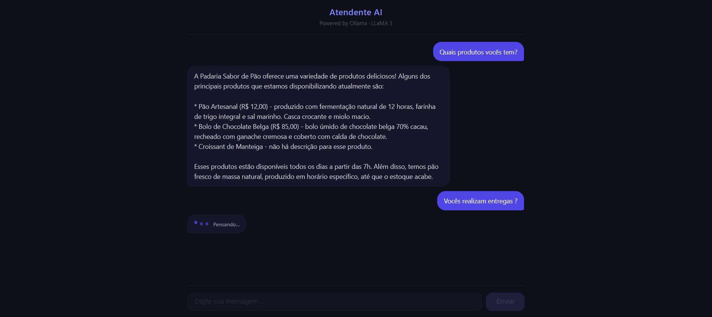
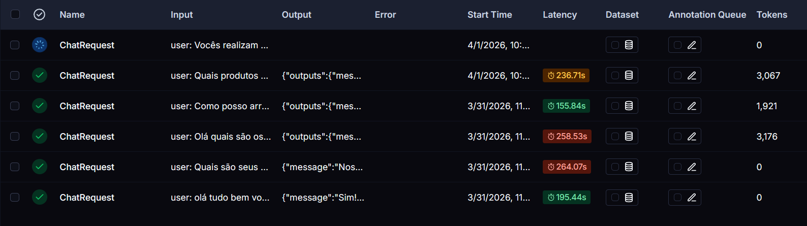

# node-ai-bakery-agent

<p>
  
  
  
  
</p>

This repository is a study on building AI Agents with Node.js, focused on a virtual customer service attendant for a bakery called **Padaria Sabor de Pão**.

The agent, named **Pãozinho**, answers customer questions about the bakery's products, prices, and general information. It uses a multi-agent architecture with an **AttendantAgent** that retrieves context via RAG (Retrieval-Augmented Generation) and a **JudgeAgent** that evaluates and validates each response before it is sent to the user.



The system uses [Qdrant](https://qdrant.tech/) as the vector database to store and search product and company data, [Ollama](https://ollama.com/) to run LLMs locally, and [LangSmith](https://www.langchain.com/langsmith) for agent tracing and observability.



To easily run the project, use this command:

```bash
docker compose -f docker-compose.infra.yaml up
```

The interface will be available at `http://localhost:8080`

## summary

- [node-ai-bakery-agent](#node-ai-bakery-agent)
  - [summary](#summary)
  - [architecture](#architecture)
  - [backend](#backend)
  - [frontend](#frontend)
  - [Run](#run)
    - [Develop](#develop)
  - [TO DO](#to-do)

## architecture

The system follows a multi-agent loop:

1. The **AttendantAgent** receives the user's question and calls tools to search the vector database for relevant product or company information.
2. The **JudgeAgent** evaluates the generated response against a defined set of rules, assigning a score from 0 to 10. A response is approved if the score is >= 7.
3. If the response is not approved, the attendant retries with feedback from the judge (up to 2 attempts). After that, a fallback message is returned.

Responses are streamed to the client via [Server-Sent Events (SSE)](https://developer.mozilla.org/en-US/docs/Web/API/Server-sent_events), emitting status events (`thinking`, `tool_call`, `judging`, `retry`, `done`) in real time.

**Models used (via Ollama):**
- `llama3.1` — for the AttendantAgent and JudgeAgent
- `nomic-embed-text` — for generating embeddings

## backend

Node.js project using [Express](https://expressjs.com/) and [TypeScript](https://www.typescriptlang.org/). The agent loop is fully implemented from scratch without LangChain, with [LangSmith](https://www.langchain.com/langsmith) integrated for tracing via the `langsmith` SDK.


## frontend

A simple interface built with vanilla HTML, CSS, and JavaScript, served by [nginx](https://nginx.org/). It communicates with the backend via SSE and displays real-time status updates while the agent processes each request.

## Run

### Develop

Run the full stack with Docker:

```bash
docker compose up
```

run the following command to open backend shell inside of the container

```bash
docker compose exec backend sh
```


## TO DO
- [ ] Add support for conversation history (multi-turn context)


<br>

---

Developed by [Alessandro Massarotti Jr](https://github.com/Alessandro-Massarotti-Jr) 🤖
